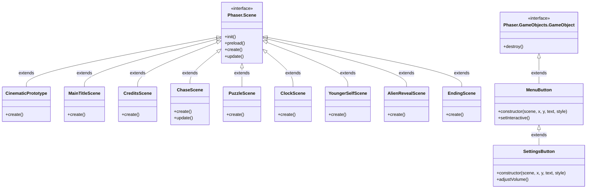

```mermaid
classDiagram
    %% Phaser Parent Classes
    class Phaser_Scene["Phaser.Scene"] {
        <<interface>>
        +init()
        +preload()
        +create()
        +update()
    }
    class Phaser_GameObject["Phaser.GameObjects.GameObject"] {
        <<interface>>
        +destroy()
    }

    %% Custom Scenes (Scene Flow Prototype)
    class CinematicPrototype {
        +create()
    }
    class MainTitleScene {
        +create()
    }
    class CreditsScene {
        +create()
    }
    class ChaseScene {
        +create()
        +update()
    }
    class PuzzleScene {
        +create()
    }
    class ClockScene {
        +create()
    }
    class YoungerSelfScene {
        +create()
    }
    class AlienRevealScene {
        +create()
    }
    class EndingScene {
        +create()
    }

    %% Custom Game Objects / Prefabs (Settings Helper)
    class MenuButton {
        +constructor(scene, x, y, text, style)
        +setInteractive()
    }
    class SettingsButton {
        +constructor(scene, x, y, text, style)
        +adjustVolume()
    }

    %% Inheritance Relationships
    Phaser_Scene <|-- CinematicPrototype : extends
    Phaser_Scene <|-- MainTitleScene : extends
    Phaser_Scene <|-- CreditsScene : extends
    Phaser_Scene <|-- ChaseScene : extends
    Phaser_Scene <|-- PuzzleScene : extends
    Phaser_Scene <|-- ClockScene : extends
    Phaser_Scene <|-- YoungerSelfScene : extends
    Phaser_Scene <|-- AlienRevealScene : extends
    Phaser_Scene <|-- EndingScene : extends

    Phaser_GameObject <|-- MenuButton : extends
    MenuButton <|-- SettingsButton : extends
```
